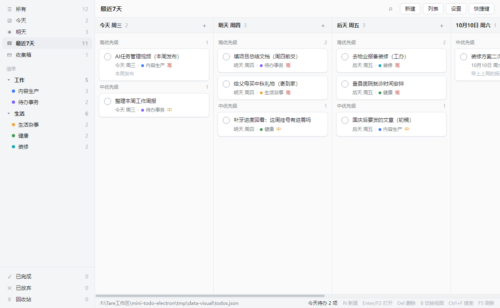
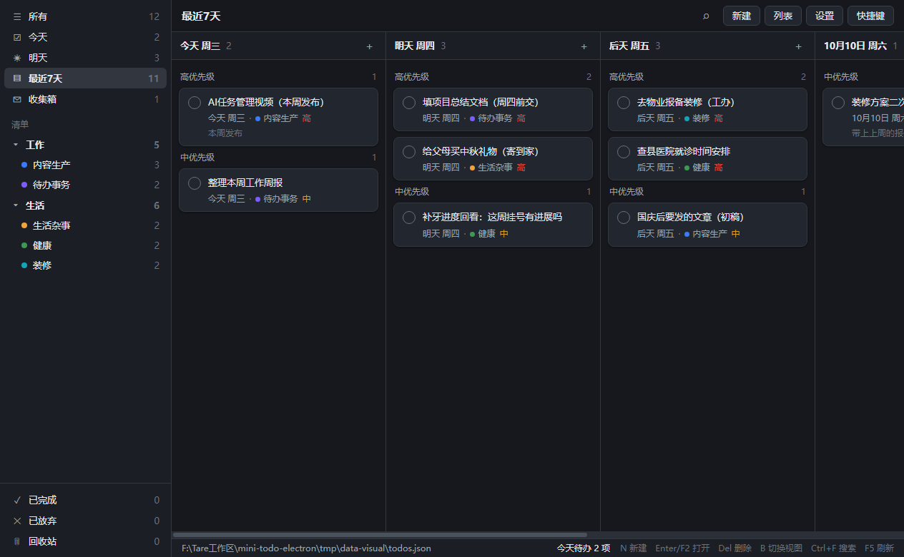
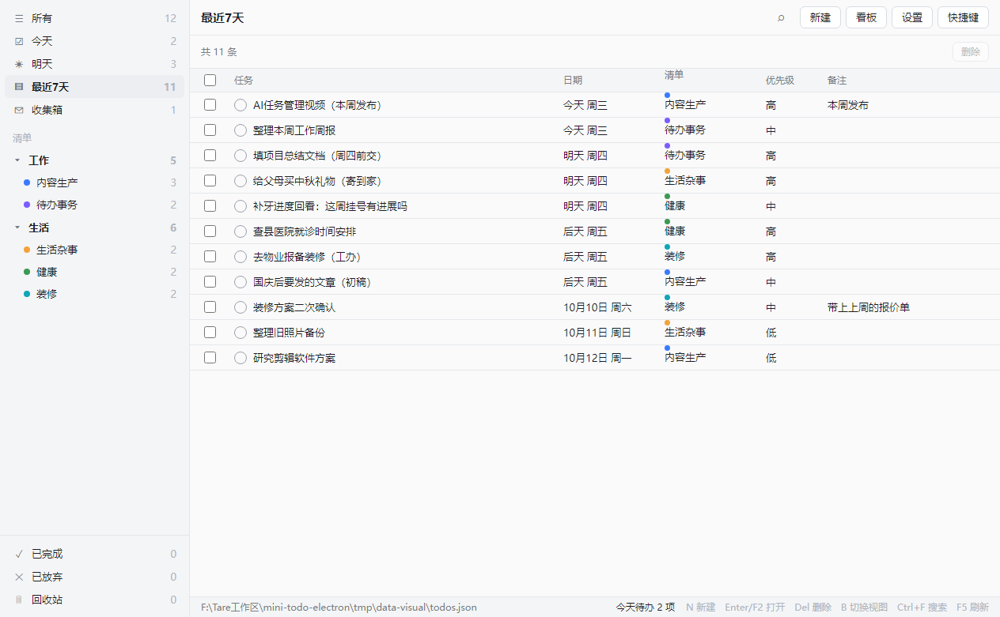

# 迷你待办 MiniTodo（Electron 版）

看板式待办管理工具，一套代码同时出 32/64 位安装包与绿色版，覆盖内网 Win7 老机器与现代 Win10/11。

这是 [MiniTodo](https://github.com/KongValley/MiniTodo)（C# WinForms / .NET 3.5 单文件版）的 Electron 重写：功能对齐旧版，并加了看板拖拽、深色主题、托盘常驻、到期通知、子任务、重复任务、自动备份与导入导出。



## 特性

| 分类 | 内容 |
| --- | --- |
| 视图 | 分组 → 清单两级侧栏；看板（**列随视图过滤**，按日期分列，列内按优先级分组）与列表两种视图，`B` 切换 |
| 侧栏 | 分组与清单可**新建、重命名、删除、拖拽排序**（清单可跨分组拖）。删清单时可选「任务移到收集箱」或「连任务一起删」；删分组则组内清单一并删除、任务统一移到收集箱，全程不丢任务 |
| 重复 | 不重复 / 每天 / 每周 / 每月 / 工作日；**每月记住原始日号**（选 31 号则 1-31 → 2-28 → 3-31，不会卡在 28 号） |
| 任务 | 标题、备注、日期（可「不排期」）、清单、优先级（高/中/低）、状态（待办/已完成/已放弃/回收站） |
| 增强 | **看板拖拽**改期与同优先级桶内排序、**深色/浅色主题**、**托盘常驻 + 到期通知**、**子任务清单**、**重复任务**、**右键菜单**（改期/改优先级/完成/删除）、**列表列排序**、**搜索词高亮**、**自动备份 + 导入导出**（导入可选替换/合并）、**自绘彩色 SVG 图标**（双主题自适应，零图标库依赖） |
| 数据 | `%APPDATA%\MiniTodoElectron\todos.json`，UTF-8 明文，可直接备份/编辑；每天自动备份到 `backups/`（保留最新 10 份） |
| 迁移 | 「文件 → 导入旧版数据…」默认指向 `%APPDATA%\MiniTodo\todos.json`，一次性导入旧版数据（导入前自动备份） |

## 快捷键

| 键 | 作用 |
| --- | --- |
| `N` | 新建任务 |
| `Enter` / `F2` | 打开选中任务（列表视图） |
| `Del` | 删除选中（回收站视图里是彻底删除） |
| `B` | 切换看板 / 列表 |
| `Ctrl+1` / `Ctrl+2` | 菜单「视图 → 看板 / 列表」 |
| `Ctrl+A` | 列表视图全选当前视图（输入框内仍是原生全选文本） |
| `Ctrl+F` | 搜索 |
| `Esc` | 关闭弹窗 / 清空搜索 |
| `F5` | 刷新 |
| `1` `2` `3` `4` | 今天 / 明天 / 最近7天 / 所有 |
| 看板内滚轮 | 上下滚动鼠标所在列 |
| `Ctrl` + 滚轮 | 看板内左右滚动日期列 |
| 拖拽卡片 | 改期 / 同优先级桶内排序 |

## 界面

左侧是视图与清单（分组 → 清单两层，每行右侧显示条数，视图行配彩色图标）；「清单」标题右侧有「+ 分组」「+ 清单」两个入口，分组与清单行鼠标移上去会出现重命名与删除图标，两行之间可拖拽调整顺序（清单可拖到别的分组下）。顶栏是视图名、搜索、新建、视图切换、设置、快捷键（四个动作按钮各带图标）；底部状态栏显示数据文件路径、今日待办数与快捷键提示。

窗口用系统原生标题栏。**关闭窗口 = 隐藏到托盘**（托盘常驻），真正退出走「文件 → 退出」或右键托盘图标 →「退出」。应用已在后台运行时**再次双击 exe 会把窗口唤到最前**（单实例锁，不会开出第二个实例）。

<table>
<tr>
<td></td>
<td></td>
</tr>
</table>

## 使用

### 安装版 / 绿色版

`release/` 下按系统与架构分目录（内容相同，仅架构与命名不同；Win7 与 Win10 两套名称的构建都是 Electron 22）：

| 目录 | 适用 |
| --- | --- |
| `Win7-32位` / `Win7-64位` | Windows 7 SP1（32 位系统选 32 位包；64 位系统两种均可） |
| `Win10-32位` / `Win10-64位` | Windows 10 / 11 |

每个目录里有两个分发物，任选其一：

| 文件 | 用法 |
| --- | --- |
| `mini-todo-setup-<版本>-<平台>.exe` | **安装版**：双击走安装向导，可选安装目录、自动建桌面快捷方式 |
| `mini-todo-portable-<版本>-<平台>.zip` | **绿色版**：解压后双击里面的 exe，无需安装。**建议先建一个专用文件夹再解压**（zip 没有外层目录，直接解压会与当前目录已有文件混在一起） |

两种分发物的启动速度相同（都在本机直接运行，不做解压）。绿色版 zip 约 83 MB（64 位）/ 78 MB（32 位），安装版 exe 约 60 MB / 57 MB —— zip 用 Deflate 而非 7z 的 LZMA，压缩比低所以略大，换来的是解压后启动快 12 倍。

**为什么没有「双击即用的便携版 exe」**：那种单文件 exe 每次启动都要把整个应用解压到 `%TEMP%` 再运行，实测十几秒 —— 这是打包器的机制（启动前无条件清空解压目录重新解压），不是程序缺陷，还会往 `%TEMP%` 留下不清理的副本。绿色版 zip 解压一次，此后每次启动都是直接运行。

**Windows 7 前置要求**：需 **Windows 7 SP1**，并补装 `前置补丁/` 里的 4 个 `.msu`（安装顺序见该目录的《安装说明.txt》，先装 KB4490628 再装 KB4474419）。Win10 及以上系统无此要求。

### 数据

- 数据文件：`%APPDATA%\MiniTodoElectron\todos.json`（UTF-8 明文，无 BOM，可直接备份/编辑）
- 首次运行会写入一套示例数据；清空该文件后重启即回到示例数据
- 备份：`%APPDATA%\MiniTodoElectron\backups\todos-<时间戳>.json`，每天最多一份，保留最新 10 份
- 设置：`%APPDATA%\MiniTodoElectron\settings.json`（主题、到期提醒开关与时间）
- 数据文件损坏时不会静默覆盖：原文件改名保留为 `todos.json.corrupt-<时间戳>`（保留最新 5 份），并提示原因
- 旧版数据（`%APPDATA%\MiniTodo\todos.json`）通过「文件 → 导入旧版数据…」导入，导入前自动备份当前数据，并可选「替换」或「合并」（合并按 id 跳过重复项，保留现有任务）
- **写盘失败不会静默**：状态栏持续显示「保存失败，数据未写入磁盘」，直到下一次保存成功——改动仍留在内存里，但不要在提示消失前关窗口

## 构建

```bash
npm install          # 需要 Node ≥ 18；Electron 二进制走 .npmrc 里的国内镜像
npm run dev          # 开发模式
npm run build        # typecheck + 构建到 out/
npm test             # 共享层纯函数自检（node --test，43 项）
npm run smoke        # 端到端冒烟（真 Electron 真窗口，29 项，含主进程侧断言、崩溃自愈、保存失败注入与侧栏管理）
npm run icon         # 生成 resources/icon.png
```

性能基准（改动数据层/渲染层后跑一次，确认没有回归）：

```bash
npm run perf:data    # 生成 tmp/perf-pristine/{500,2000,5000}.json 三档数据
npm run perf         # 三档 × 3 次取中位数，结果写 tmp/perf-current.json
```

`npm run perf` 每档都从 pristine 副本重置数据，保证三次跑在同一负载上。想看相对提升就把两次结果对比：

```bash
node scripts/perf-compare.mjs before 3
# 改代码 → npm run build
node scripts/perf-compare.mjs after 3
```

## 性能

5000 条任务下（同一台机器，`npm run perf` 中位数）：

| 交互 | 优化前 | 优化后 |
| --- | --- | --- |
| 切换视图 | 1860 ms | **21 ms** |
| 切到列表并滚到底 | 2679 ms | **60 ms** |
| 完成一条任务 | 806 ms | **69 ms** |
| 拖拽改期 | 821 ms | **70 ms** |
| 新建任务 | 663 ms | **49 ms** |
| 搜索 | 458 ms | **72 ms** |
| 主线程总阻塞 | 8371 ms | **52 ms** |
| DOM 卡片数 | 3760 | **65** |

关键设计（改这些地方时注意别退回去）：

- `state.store` 用 `markRaw` 包住 —— 派生数据统一由 `store/index.ts` 的 `index` computed 提供，不依赖字段级追踪
- 视图计数/看板列走 `shared/store-index.ts` 的**单次扫描索引**，不是逐视图扫描。**但看板列要走 `query.ts` 的 `columnsForView()`** —— `index.columns` 是全量扫描的结果，直接喂看板会在「今天」视图下仍列出未来日期的列
- 看板卡片与列表行都是**窗口化渲染**（`lib/virtual.ts`），只渲染可视区
- 保存时 store 以**序列化字符串**过 IPC（传对象要结构化克隆 7.5 万个对象）
- 落盘不做逐条 `normalizeStore`（只在导入文件这条不可信路径上做）

## 图标

全部手绘内联 SVG，**不引图标库**。`Icon.vue` 里两张表：

| 表 | 形态 | 配色 | 用在哪 |
| --- | --- | --- | --- |
| `PART` | 多部件实心（主体 + 阴影 + 镂空） | 每件自带 `var(--ico-*)` | 侧栏 8 个视图、顶栏按钮、右键菜单 |
| `STROKE` / `FILL` | 单色描边 / 实心 | `currentColor`，跟随所在行文字色 | 卡片内的搜索、勾、加号、优先级旗标 |

- 配色 9 组 token，浅色/深色各一套；镂空细节用 `var(--card)`，深色下自动翻成内凹
- 组件里禁止硬编码色值，一律走 `var(--*)`
- 改 `PART` 时注意：**笔画形（勾/叉/箭头）必须给 `s`（描边宽度）走描边渲染**。这类路径直接 `fill` 是零面积的，画出来什么都没有
- `STROKE` 每项必须是**一条完整**的 `d`（数组元素）。别把多条子路径拼成一个字符串再按空格拆 —— 路径里的空格是参数分隔符，拆出来的是语法非法的碎片，`<svg>` 元素在但一个像素都不画

## 内存

**先确定口径**：同一时刻三种读法差 3 倍以上，混用会得出完全不同的结论。5000 条任务实测（本机 Win10，无 GPU 机器，应用已 `disableHardwareAcceleration()`）：

| 口径 | 读法 | 空白 Electron（无业务代码） | 本应用 [5000 条] | < 200 MB |
|---|---|---|---|---|
| **任务管理器「内存」列**（私有工作集） | 外部 PowerShell，见下 | ~66 MB | **~83 MB** | ✓ |
| 私有提交 | `getAppMetrics().privateBytes` 合计 | ~114 MB | 空闲 ~149 MB / 刚操作完 ~205 MB | 空闲 ✓ |
| 工作集合计（含共享 Chromium DLL） | `getAppMetrics().workingSetSize` 合计 | ~251 MB | ~371 MB | ✗ |

三个结论：

1. **任务管理器口径下 83 MB，远低于 200 MB**；距空白 Electron 的 66 MB 下限只差 17 MB，这 17 MB 就是全部业务代码（5000 条数据 + 看板/列表/索引）。这一列不随操作波动。
2. **工作集合计口径下 200 MB 不可达** —— 空白 Electron 窗口就已 251 MB（共享的 Chromium DLL 页被算进每个进程）。任何"把工作集压到 200"的尝试都是徒劳，别为此加启动开关。
3. `privateBytes` 常被误当成任务管理器那列，实测它是「私有提交」，约为前者的 1.6 倍；它会随 V8 堆回收时机波动（空闲 ~149 MB，刚跑完一批操作 ~205 MB），因此只适合当**泄漏探测**阈值，不适合当内存预算。

读任务管理器口径（应用运行时另开终端）：

```bash
powershell -NoProfile -Command "$c=Get-Counter '\Process(electron*)\Working Set - Private' -ErrorAction SilentlyContinue; [math]::Round((($c.CounterSamples|Measure-Object -Property CookedValue -Sum).Sum)/1MB,0)"
```

`npm run perf` 每档会打印私有提交与工作集合计；私有提交越过 320 MB 上限时脚本以非零码退出并提示疑似泄漏（正常波动不会触发）。

内存没有"可优化的浪费"：应用自身只占 17 MB，且已排查过两处疑似点（`label()` 的逐行 `new Date()`、状态栏的 `countDue()` 全表扫描），实测前者加缓存反而慢 18%、后者只省 0.147 ms，都不值得改（见 `dates.ts` 里 `label()` 上方的注释）。

无 GPU 机器上的进程构成：Browser / GPU / Utility(Network Service) / Tab 四个。GPU 进程在 `disableHardwareAcceleration()` 下依然存在 —— 它是 Chromium 的合成进程（走软件路径，`getGPUFeatureStatus()` 显示 `gpu_compositing: disabled_software`），不是显卡驱动进程，无法消除。`--in-process-gpu` 可把它并入主进程（进程数 4→3、工作集合计降约 30 MB），但私有提交几乎不变且 GPU 崩溃会带倒整个应用，因此默认不启用。


打包（每架构一条，产物在 `release/<中文目录>/`）：

```bash
npm run dist:win7-32     # → release/Win7-32位/
npm run dist:win7-64     # → release/Win7-64位/
npm run dist:win10-32    # → release/Win10-32位/
npm run dist:win10-64    # → release/Win10-64位/
npm run dist             # 四个架构依次全打
```

Win7 目录里的「前置补丁」来自仓库根的 `win7-patches/`（该目录体积大、已 gitignore，首次打 Win7 包前需自行放入 4 个 `.msu`；缺目录时打包只提示不失败）。

## 发布（GitHub Actions 云端打包）

不想在本机跑 `npm run dist`、也不想手动往 Release 拖 8 个 exe，就用云端流水线：`.github/workflows/release.yml` 在 GitHub 的 windows runner 上跑**同一套** `package-win.mjs`，四个架构并行，产物直接传成 Release 资产。本地打包的路径仍然保留，两条路互不依赖。

**一次性准备** —— 把 Win7 前置补丁传成一个常驻 Release。`win7-patches/` 有 121 MB 且已 gitignore，仓库里没有，CI 不打这个种子就会缺补丁：

```bash
gh release create win7-patches --title "Win7 前置补丁源" --notes "CI 构建时按架构取用,勿删" win7-patches/*.msu
```

**每次发布**，二选一：

| 方式 | 操作 |
| --- | --- |
| 网页触发 | Actions → release → Run workflow，填版本号（留空取 `package.json`）；`publish=false` 可只验证构建不发布 |
| 打 tag | `npm version 1.1.0 && git push origin v1.1.0`（tag 与 `package.json` 版本不一致会直接拒绝发布） |

流水线做的事：`npm ci` → 按架构下载对应 `.msu` → `npm run build` → `node scripts/package-win.mjs <架构>` → 汇总成 Release 资产：**4 个安装版 exe** + **4 个绿色版 zip** + **8 个 `.msu`**（两个 Win7 架构各 4 个）+ **1 份 `win7-patches-readme.txt`**（两个 Win7 架构各有一份中文《安装说明.txt》，只取一份），共 17 个。tag 已存在时会先删旧 Release 再重建，方便重跑。

汇总只收 `mini-todo-*.exe` / `mini-todo-*.zip` 与 `前置补丁/` 下的 `.msu`，electron-builder 留在 `release/` 里的暂存目录（`win-unpacked/`）和助手程序（`elevate.exe`）不会混进资产。**资产名一律 ASCII** —— `gh release create` 会把非 ASCII 文件名压成 `default.txt`（内容完好、名字没了），所以本地分发目录里用中文名，上传前复制成 `win7-patches-readme.txt`；资产数不等于 17、或 `dist/` 里出现非 ASCII 文件名，流水线都会失败。

补丁取不到时流水线**直接失败**，不会产出一个缺补丁的 Win7 裸包 —— 那种包在 Win7 机器上根本起不来，静默发布比构建失败危险得多。同理，某个架构取到的 `.msu` 不等于 4 个也会失败。

## 代码结构

```
src/shared/types.ts       数据模型与常量（状态/优先级/视图名）
src/shared/dates.ts       日期工具（今天/加减/周几/标签/下次重复日期），本地时区
src/shared/store-index.ts 单次扫描索引（视图计数 + 全量看板列 + 搜索命中）—— 性能关键路径
src/shared/query.ts       排序、分桶、查表与 columnsForView（看板列按视图过滤后的分桶）
src/shared/store-ops.ts   数据变更纯函数（不可变，含分组/清单增删改排序）+ normalizeStore 唯一信任边界
src/shared/api.ts         preload 契约与 IPC 通道名
src/shared/store-ops.test.ts  纯函数与索引自检（node --test）

src/main/index.ts         窗口（原生边框）/ 托盘常驻 / 协议 / 启动流程
src/main/ipc.ts           IPC handler（统一 ok/error 兜底）+ 菜单导入导出
src/main/lib/store.ts     原子写 / 损坏文件隔离 / 每日备份 / 导入导出
src/main/lib/settings.ts  主题与提醒设置
src/main/lib/tray.ts      托盘与今日计数
src/main/lib/notify.ts    到期提醒（每分钟检查，同日不重复发）
src/main/lib/paths.ts     数据目录与文件路径
src/main/menu.ts          应用菜单
src/main/smoke.ts         无头冒烟工具

src/preload/index.ts      contextBridge 暴露 todoAPI
src/renderer/src/store/data.ts    数据源（markRaw，只整体替换）
src/renderer/src/store/index.ts   响应式索引 computed（各组件统一读它）
src/renderer/src/store/ui.ts      界面状态
src/renderer/src/store/settings.ts 设置与主题
src/renderer/src/lib/virtual.ts   窗口化渲染（固定行高 + 测量式可变高度）
src/renderer/src/lib/keymap.ts    快捷键
src/renderer/src/lib/selection.ts 列表多选状态 + Ctrl+A 行源
src/renderer/src/lib/search.ts    搜索词命中片段（标题高亮用）
src/renderer/src/components/Icon.vue      全站 SVG 图标（PART 表=多部件实心彩色，配色走 --ico-* token；STROKE/FILL 表=单色描边，跟随 currentColor）
src/renderer/src/components/  侧栏 / 顶栏 / 状态栏 / 看板 / 列表 / 右键菜单 / 各弹窗
src/renderer/src/test-api.ts  冒烟用 window.__todoTest
scripts/run-smokes.mjs    冒烟运行器（28 步，含主进程侧断言、崩溃与保存失败注入）
scripts/smoke/step*.js    各步断言
scripts/gen-perf-data.mjs 生成性能基准数据
scripts/perf-probe.js     性能探针（长任务 + 墙钟）
scripts/perf-compare.mjs  性能基准运行器（三档 × N 次取中位数）
scripts/package-win.mjs   单架构打包 + 前置补丁分发
.github/workflows/release.yml  云端四架构打包 + 发 Release（见 §发布）
```

## 已知限制

- 单机本地存储，没有同步/多端；换机器要手动拷 `todos.json` 或「导出数据」
- 看板列宽固定 300 px；卡片标题最多两行
- 列表行高固定 32 px（虚拟滚动据此窗口化，改成自适应行高需一并换测量式实现）
- 看板卡片高度可变，虚拟滚动先按估算高度布局、挂载后按实测校正，极快滚动时可能有 1 帧的偏移跳动
- 提醒时间用本机时区，不处理跨时区
- 应用基于 Electron 22（Chromium 108）：这是为兼容 Win7 而选，现代机器上 Chromium 偏旧
- 渲染进程崩溃会自动重载页面自愈（连续崩超 3 次停止重载，需手动重启）；但崩溃瞬间的未落盘改动会丢——`todos.json` 每次变更即写盘，窗口内尚未提交的操作才会丢

## 许可

GPL-3.0-or-later
